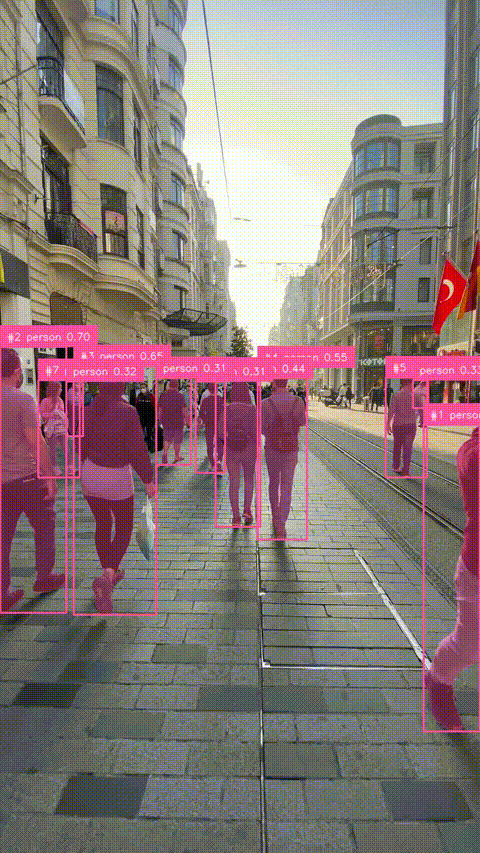
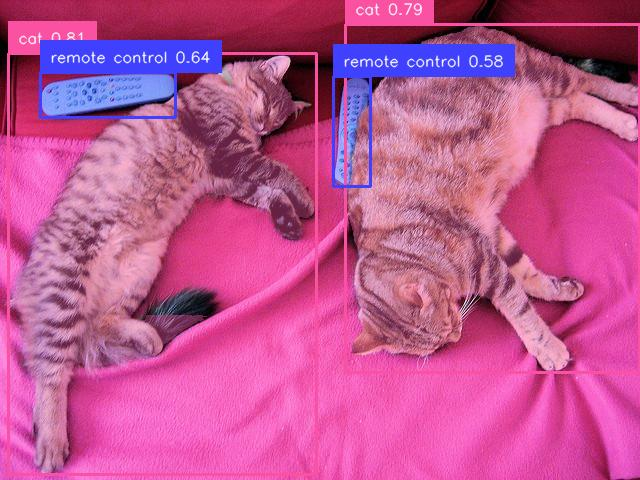
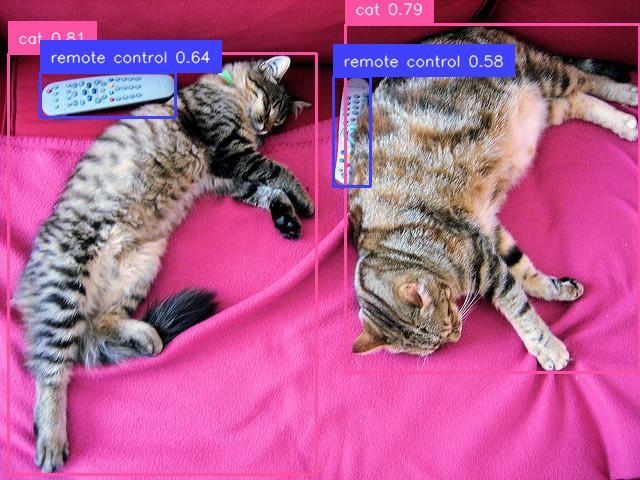
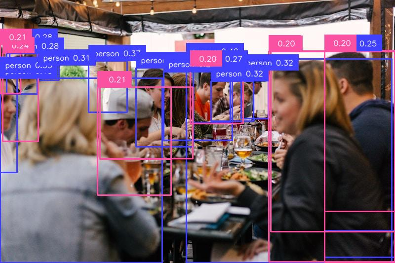
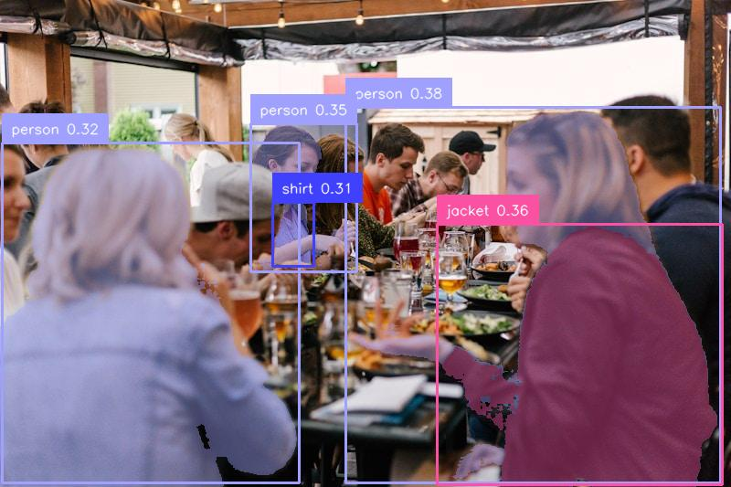
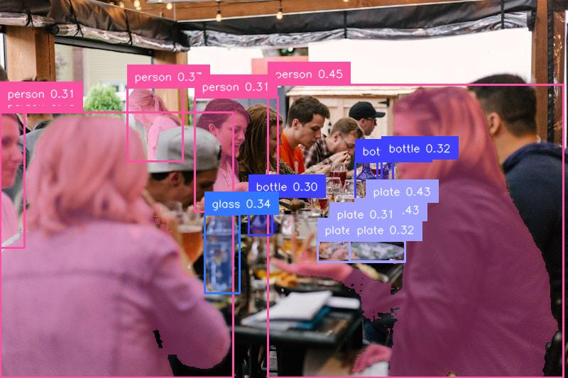

# Open-Vocabulary Perception (OVP)

> A modular pipeline for **text-prompted object detection, segmentation, and tracking**, combining GroundingDINO (open-vocabulary detection) with SAM 2 (class-agnostic segmentation) and ByteTrack (cross-frame identity). Built with a strict no-vibe-coding philosophy: every component is hand-written, every design decision documented.



*Real-time tracking on a busy İstanbul pedestrian scene. Track IDs (#1, #2, ...) remain consistent across frames; bounding boxes and masks update on keyframes via GroundingDINO + SAM 2.*

```bash
ovp-video -v input.mp4 -p "person" -o annotated.mp4
```

---

## Why This Project

Open-vocabulary perception is the natural evolution of closed-class detection. Instead of training on a fixed taxonomy, the model accepts arbitrary text queries at inference time. This project demonstrates how to compose three state-of-the-art components — **GroundingDINO** (text → bounding box), **SAM 2** (bounding box → pixel mask), and **ByteTrack** (cross-frame identity) — into a unified, production-ready pipeline that scales from single images to streaming video.

Built and tested on RTX 3050 Ti Laptop (4GB VRAM). All three components fit comfortably (~530MB total VRAM when loaded together).

---

## Architecture

```
text prompts ──► GroundingDinoDetector ──► Detection (bbox + label + score)
                                                 │
                            ┌────────────────────┤
                            ▼                    ▼
                    Sam2Segmenter         ByteTracker
                            │                    │
                            ▼                    ▼
                          Mask              Track (persistent ID)
                            │                    │
                            └────────┬───────────┘
                                     ▼
                    ImagePipeline / VideoPipeline
                                     │
                                     ▼
                              FrameResult (Pydantic)
```

Strategy pattern + Dependency Injection throughout. Each component implements an abstract base class (`BaseDetector`, `BaseSegmenter`, `BaseTracker`) and registers itself in a type-safe registry. Adding a new detector means writing one file — no changes to pipeline code.

```
src/ovp/
├── core/             # types, interfaces, registry
├── detectors/        # GroundingDinoDetector
├── segmenters/       # Sam2Segmenter
├── trackers/         # ByteTracker
├── pipeline/         # ImagePipeline, VideoPipeline
├── viz/              # FrameAnnotator (track-aware)
├── io/               # VideoReader, VideoWriter
└── scripts/          # ovp-image, ovp-video CLI entry points
```

---

## Installation

Requires Python 3.10+ and a CUDA-capable GPU (tested on CUDA 13.0).

```bash
# Clone and enter
git clone https://github.com/e-cagan/open-vocab-perception.git
cd open-vocab-perception

# Create environment
python -m venv .venv
source .venv/bin/activate
pip install --upgrade pip setuptools wheel

# PyTorch (match your CUDA version)
pip install torch torchvision --index-url https://download.pytorch.org/whl/cu121

# Install package + dependencies
pip install -e ".[notebook]"
```

---

## Usage

### Image Pipeline

Detect and segment a single image:

```bash
ovp-image -i path/to/image.jpg -p "person,car,bicycle" -o annotated.jpg
```

Detection only (skip segmentation for faster inference):

```bash
ovp-image -i path/to/image.jpg -p "cat" --no-segmenter -o detection_only.jpg
```

Tune confidence threshold:

```bash
ovp-image -i path/to/image.jpg -p "person" -t 0.5 -o filtered.jpg
```

See `ovp-image --help` for all options.

### Video Pipeline

Run the full pipeline on a video with persistent tracking:

```bash
ovp-video \
  --video input.mp4 \
  --prompts "person,car" \
  --output annotated.mp4 \
  --keyframe-interval 10
```

The `--keyframe-interval` flag controls how often the detector and segmenter run (default: every 10 frames). Between keyframes, ByteTrack maintains object identity, and the cached keyframe results are reused — this is the key trade-off for video latency.

Optional flags: `--no-tracker`, `--no-segmenter`, `--max-frames N` (limit frames for testing).

See `ovp-video --help` for all options.

### Programmatic API

Image:

```python
from ovp.detectors.grounding_dino import GroundingDinoDetector
from ovp.segmenters.sam2 import Sam2Segmenter
from ovp.pipeline.image_pipeline import ImagePipeline
from ovp.viz.annotators import FrameAnnotator
import numpy as np
from PIL import Image

detector = GroundingDinoDetector(threshold=0.3)
segmenter = Sam2Segmenter()
pipeline = ImagePipeline(detector=detector, segmenter=segmenter)

image = np.array(Image.open("scene.jpg").convert("RGB"))
result = pipeline.run(image, prompts=["person", "car"])

print(f"Found {len(result.detections)} objects")
print(f"Latency: {result.inference_times}")

annotated = FrameAnnotator().annotate(image, result)
Image.fromarray(annotated).save("output.jpg")
```

Video:

```python
from ovp.detectors.grounding_dino import GroundingDinoDetector
from ovp.segmenters.sam2 import Sam2Segmenter
from ovp.trackers.bytetrack import ByteTracker
from ovp.pipeline.video_pipeline import VideoPipeline
from ovp.viz.annotators import FrameAnnotator
from ovp.io.readers import VideoReader
from ovp.io.writers import VideoWriter

pipeline = VideoPipeline(
    detector=GroundingDinoDetector(threshold=0.3),
    segmenter=Sam2Segmenter(),
    tracker=ByteTracker(),
    keyframe_interval=10,
)
annotator = FrameAnnotator()

with VideoReader("input.mp4") as reader, \
     VideoWriter("output.mp4", fps=reader.fps, width=reader.width, height=reader.height) as writer:
    for frame, result in pipeline.run_video(iter(reader), prompts=["person"]):
        annotated = annotator.annotate(frame, result)
        writer.write(annotated)
```

---

## Examples

### Detection + Segmentation vs Detection Only

The pipeline supports detection-only mode for use cases where masks are not needed (e.g., bbox tracking, lightweight inference).

| Full pipeline | Detection only |
|---|---|
|  |  |

### Threshold Tuning

The detector confidence threshold controls precision/recall trade-off. Default 0.3 works well for most scenes; tune up for cleaner output, down for higher recall.

| `-t 0.2` (low) | `-t 0.5` (high) |
|---|---|
|  |  |

Low threshold produces many low-confidence false positives. High threshold may miss valid objects entirely. The default of 0.3 sits in the practical sweet spot.

---

## Limitations

This project is honest about what works and what doesn't.

### Compound queries are weakly enforced

GroundingDINO treats attributes as soft hints, not hard constraints. Querying for `"person wearing white shirt"` will likely match all persons regardless of clothing.



For attribute-sensitive use cases, consider noun-only prompts followed by a downstream classifier (e.g., CLIP-based filtering on detection crops).

### Crowded scenes lack post-processing

The pipeline currently lacks proper NMS or duplicate suppression. In dense scenes, multiple overlapping bounding boxes for the same person can produce visually noisy mask overlays.



A future version will integrate class-aware NMS in the pipeline orchestrator.

### Bounding boxes are static between keyframes

`VideoPipeline` caches the last keyframe's results between detector calls. Track IDs are preserved by ByteTrack, but bbox coordinates do not update between keyframes — a moving person's box stays in the keyframe position for up to N-1 frames. Visible at low keyframe intervals; reduces with larger keyframe gaps. Future versions will use SAM 2's video predictor for inter-keyframe mask propagation.

### Latency is not real-time on consumer GPUs

Per-frame video pipeline cost is ~65ms on RTX 3050 Ti (with `keyframe_interval=10`), giving ~15 FPS effective throughput. Real-time (30 FPS) requires either a more powerful GPU, larger keyframe intervals, or fp16 inference (planned).

---

## Performance

Benchmarks on RTX 3050 Ti Laptop GPU (4GB VRAM), fp32, 640×480 image / 720×1280 video:

| Component | Latency | VRAM |
|---|---|---|
| GroundingDINO-tiny (detector) | ~430 ms | 337 MB |
| SAM 2.1 Hiera-tiny (segmenter, 4 boxes) | ~160 ms | 121 MB |
| ByteTrack (tracker, per frame) | <5 ms | negligible |
| **Image pipeline (end-to-end)** | **~600 ms** | **~526 MB** |
| **Video pipeline (avg per frame, k=10)** | **~65 ms** | **~530 MB** |

SAM 2's promptable architecture decouples image encoding (~140 ms, runs once) from mask decoding (~4 ms per box, scales with prompt count). Dense scenes with 10–20 detections do not significantly slow segmentation.

The video pipeline exploits this with a keyframe strategy: detector + segmenter run on every Nth frame, ByteTrack maintains identity in between. Effective throughput is ~15 FPS at `keyframe_interval=10`.

---

## Sandbox Notebooks

Each model was systematically tested before being wrapped in production classes. The notebooks document threshold sensitivity, latency profiling, and behavioral observations:

- [`notebooks/01_grounding_dino_sandbox.ipynb`](notebooks/01_grounding_dino_sandbox.ipynb) — GroundingDINO behavior, threshold sweeps, compound query analysis
- [`notebooks/02_sam2_sandbox.ipynb`](notebooks/02_sam2_sandbox.ipynb) — SAM 2 mask quality, multi-mask selection, latency scaling with bbox count
- [`notebooks/03_sam2_video_sandbox.ipynb`](notebooks/03_sam2_video_sandbox.ipynb) — SAM 2 Video Predictor, memory bank propagation, multi-object tracking, latency findings vs image predictor

---

## Roadmap

- [x] Image pipeline (detector + segmenter)
- [x] CLI entry points (`ovp-image`, `ovp-video`)
- [x] Pydantic-based type system with validation
- [x] Strategy pattern + registry for component swapping
- [x] **VideoPipeline** with keyframe strategy
- [x] **ByteTracker integration** for persistent track IDs
- [x] **Track-aware visualization** (track IDs in annotated output)
- [ ] **NMS post-processing** for crowded scenes
- [ ] **fp16 inference** with proper autocast (currently fp32 baseline)
- [ ] **CLIP-based attribute filter** as optional pipeline stage
- [ ] **SAM 2 video predictor integration** for inter-keyframe mask propagation
- [ ] **Quantitative benchmarks** on COCO val2017 (mAP@0.5, mIoU, FPS)
- [ ] **Test coverage** with pytest
- [ ] **Docker container** for reproducible deployment
- [ ] **CI/CD** with GitHub Actions

---

## Tech Stack

- **Models:** GroundingDINO (IDEA-Research), SAM 2 (Meta AI)
- **Tracking:** ByteTrack (via supervision)
- **ML framework:** PyTorch 2.11 + CUDA 13.0
- **HF integration:** transformers 4.57
- **Visualization:** supervision (Roboflow)
- **Type system:** Pydantic v2
- **CLI:** Typer + Rich
- **Config:** OmegaConf
- **Video I/O:** OpenCV

---

## License

MIT

---

## Author

**Emin Çağan Apaydın** — Computer Engineering, Istanbul Okan University  
GitHub: [@e-cagan](https://github.com/e-cagan)